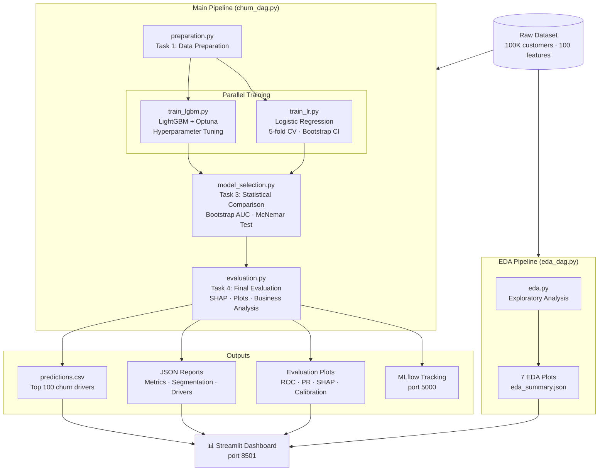

#  Telecom Churn Prediction — End-to-End ML Pipeline


> A production-grade machine learning pipeline that predicts telecom customer churn using Apache Airflow orchestration, LightGBM with Optuna hyperparameter tuning, SHAP explainability, and an interactive Streamlit business dashboard.

---

## Overview

This project implements a complete ML lifecycle for **telecom customer churn prediction** on a dataset of ~47,000 customers with 230 raw features. The pipeline is fully containerised with Docker and orchestrated by Apache Airflow, covering data preparation, exploratory analysis, dual-model training, statistical model selection, SHAP-based explainability, and an executive-level business dashboard.

**Key highlights:**
- Statistically rigorous model comparison (bootstrap AUC + McNemar test)
- Optuna hyperparameter optimisation with strict train-only evaluation
- SHAP TreeExplainer / LinearExplainer for full model transparency
- Business-oriented threshold selection (precision ≥ 60%, max recall)
- Gain curve segmentation for targeted retention campaigns
- MLflow experiment tracking across all training runs

---

## Business Objective

Telecom operators lose significant revenue when customers switch providers (**churn**). The cost of acquiring a new customer is 5–10× higher than retaining an existing one. This pipeline addresses two core business questions:

1. **Who is likely to churn?** — Identify the highest-risk customers before they leave.
2. **Why are they churning?** — Explain individual predictions with SHAP feature contributions.

The model is optimised for **business-usable precision** (≥60%) at **maximum recall** — ensuring that retention campaigns are both cost-effective and comprehensive.

---

## Architecture



---

## Project Structure

```
airflow-project/
├── dags/
│   ├── churn_dag.py          # Main 4-task ML pipeline
│   ├── eda_dag.py            # Standalone EDA pipeline
│   └── src/
│       ├── preparation.py    # Task 1: Data cleaning & feature engineering
│       ├── train_lr.py       # Task 2a: Logistic Regression
│       ├── train_lgbm.py     # Task 2b: LightGBM + Optuna
│       ├── model_selection.py # Task 3: Statistical model comparison
│       └── evaluation.py     # Task 4: SHAP + plots + business analysis
├── data/
│   ├── dataset.csv           # Raw telecom dataset (45 MB)
│   └── data_descriptions.csv
├── models/                   # Trained model artefacts (generated)
├── outputs/                  # All analysis outputs (generated)
│   └── eda/                  # EDA plots and summary
├── app.py                    # Streamlit dashboard
├── docker-compose.yaml       # Full stack definition
├── Dockerfile                # Custom Airflow + ML deps image
└── requirements.txt
```

---

## Pipeline Components

### Task 1 — Data Preparation (`preparation.py`)

**Input:** `dataset.csv` (semicolon-separated, comma-decimal format)

**Operations:**
- Decimal separator normalisation (`,` → `.`)
- Identifier column removal (`Customer_ID`, `vpn_key*`)
- Missing value analysis and treatment:
  - Drop columns with >50% missing
  - Add `was_missing` binary flags for 20–50% missing (informative missingness)
- **Feature engineering** (domain-motivated):
  - `recent_usage_delta` = avg3mou − avg6mou (usage trend proxy)
  - `drop_rate` = drop_vce_Mean / (plcd_vce_Mean + 1) (service quality)
  - `old_phone` = (eqpdays > 500) (equipment age threshold)
- **Robustness checks:** empty dataset, target existence, NaN-free target, ≥2 classes, duplicate count
- **Output report:** `outputs/preparation_report.json`

**Outputs:** `dataset_lr_raw.pkl`, `dataset_lgbm.pkl`

### EDA (`eda.py`)

Seven analyses saved to `outputs/eda/`:

| # | Plot | Description |
|---|------|-------------|
| 1 | Target distribution | Churn class balance (bar + pie) |
| 2 | Missing values | Per-column missing % with treatment thresholds |
| 3 | Numeric distributions | Top 12 features by churn correlation, split by class |
| 4 | Outlier detection | Z-score method (\|z\| > 3), features with >1% outliers |
| 5 | Churn by categorical | Churn rate per category vs global average |
| 6 | Correlation heatmap | Feature intercorrelation (top 20 by churn correlation) |
| 7 | Top features boxplot | Mann-Whitney U test with significance stars |

`eda_summary.json` includes: dataset shape, churn rate, top-10 correlations, missing percentages, **duplicate row count**, **categorical cardinality**.

### Task 2a — Logistic Regression (`train_lr.py`)

Leakage-free sklearn `Pipeline`:
```
ColumnTransformer (TargetEncoder) → SimpleImputer (median) → RobustScaler → LogisticRegression (C=0.1, L2)
```

- Train/test split: 80/20, seed=42 (same as LightGBM for fair comparison)
- Multicollinearity drop: Pearson |r| > 0.85 (computed on X_train only)
- 5-fold stratified CV with 95% bootstrap CI on all metrics
- Threshold selection via **out-of-fold (OOF) cross-validation** on X_train (no test leakage):
  - `best_f1_threshold`: argmax F1 across OOF predictions
  - `business_threshold`: max recall with precision ≥ 60% across OOF predictions
  - Falls back to a single internal validation split if OOF fails

### Task 2b — LightGBM + Optuna (`train_lgbm.py`)

**Coherent training flow:**
1. Train/test split (80/20, seed=42)
2. **Optuna optimisation on TRAIN SET ONLY** — 20 trials, 3-fold inner CV, never touches test set
3. Retrieve `best_params` (or fall back to `BASELINE_PARAMS` if Optuna fails)
4. **5-fold CV using `best_params`** — no leakage from Optuna results
5. **Threshold selection using `best_params`** — **out-of-fold CV** on X_train (falls back to inner 80/20 split)
6. **Final training on full train set using `best_params`**
7. Final evaluation on untouched test set

**Optuna search space:**

| Parameter | Range |
|-----------|-------|
| `learning_rate` | log-uniform [0.01, 0.12] |
| `num_leaves` | int [15, 63] |
| `max_depth` | int [3, 8] |
| `min_child_samples` | int [20, 100] |
| `subsample` | uniform [0.6, 1.0] |
| `colsample_bytree` | uniform [0.6, 1.0] |
| `reg_alpha` | log-uniform [0.001, 1.0] |
| `reg_lambda` | log-uniform [0.001, 1.0] |

Each Optuna trial is logged as a **nested MLflow run**. MLflow logs the **actual parameters used** by the final model (not hardcoded defaults).

### Task 3 — Model Selection (`model_selection.py`)

Statistical comparison between Logistic Regression and LightGBM:

- **Primary:** Bootstrap AUC difference (500 resamples). H₀ rejected if 95% CI excludes zero.
- **Secondary:** McNemar test on threshold-0.5 binary predictions.
- **Decision rule:**
  - No significant AUC difference → prefer LR (Occam's razor)
  - Exception: if LightGBM recall is >3 pp higher → prefer LightGBM (churn-critical)
  - Significant difference → prefer higher AUC model

### Task 4 — Final Evaluation + SHAP (`evaluation.py`)

Comprehensive evaluation on the untouched hold-out test set:

- All metrics with 95% bootstrap CI (AUC-ROC, F1, Precision, Recall, Avg Precision)
- **Bootstrap CI bands** on ROC curve, Precision-Recall curve, and gain curve (n=100 resamples)
- **Calibration analysis** with approximate ECE (Expected Calibration Error)
- **SHAP Explainability:**
  - LightGBM → `TreeExplainer` (exact Shapley values, O(TLD) complexity)
  - Logistic Regression → `LinearExplainer` with RobustScaler awareness
  - Summary plot (mean |SHAP|), bar chart, waterfall for the highest-risk customer
  - Spearman rank correlation between SHAP importance and LR coefficients
- **Business segmentation:** top 10/20/30% lift analysis, gain curve
- **Threshold optimisation:** best-F1 and business threshold (precision ≥ 60%)

**Generated outputs (15+ artefacts):**

| Artefact | Description |
|----------|-------------|
| `roc_curve.png` | ROC curve with AUC annotation |
| `precision_recall_curve.png` | PR curve |
| `calibration_curve.png` | Calibration plot with approximate ECE |
| `confusion_matrix.png` | At threshold 0.5 |
| `confusion_matrix_business_threshold.png` | At business threshold |
| `shap_summary.png` | Mean \|SHAP\| feature importance |
| `shap_bar.png` | SHAP bar chart |
| `shap_waterfall.png` | Waterfall for top-risk customer |
| `gain_curve.png` | Cumulative gain curve |
| `precision_recall_vs_threshold.png` | Threshold sensitivity |
| `final_evaluation.json` | All metrics + thresholds + model info |
| `model_selection_report.json` | Statistical comparison details |
| `business_segmentation.json` | Gain curve + segment stats |
| `predictions.csv` | Full predictions with 3 threshold columns |
| `top_churn_drivers.json` | Top 100 high-risk customers + SHAP drivers |

---

## MLflow Tracking

All experiments are tracked in MLflow at **http://localhost:5000**.

- **LightGBM_Optuna_Study** run: top-level run with nested trial runs
- **LightGBM** run: final model metrics + **actual tuned params**, thresholds, threshold selection source, dataset sizes, and feature counts
- **Logistic Regression** run: CV metrics + pipeline params, thresholds, encoder type, and dropped multicollinear feature count
- **Final_Evaluation** run: all evaluation artifacts logged (JSON reports, plots) as MLflow artifacts

---

## Streamlit Dashboard

Interactive business dashboard at **http://localhost:8501** with four tabs:

| Tab | Content |
|-----|---------|
|  Model Performance | KPI cards with bootstrap CI, ROC/PR/SHAP/Calibration plots, confusion matrices |
|  Business Segmentation | Gain curve, segment KPIs (top 10/20/30%), churn probability distribution |
|  High-Risk Customers | Filterable table of top-100 customers with risk scores and SHAP drivers |
| EDA | All 7 EDA plots with captions, dataset summary stats, correlation table, cardinality |

---

## Tech Stack

| Component | Technology |
|-----------|-----------|
| Orchestration | Apache Airflow 2.9.0 (CeleryExecutor) |
| ML — Gradient Boosting | LightGBM |
| ML — Linear Model | scikit-learn LogisticRegression |
| Hyperparameter Tuning | Optuna |
| Explainability | SHAP |
| Experiment Tracking | MLflow |
| Dashboard | Streamlit + Plotly |
| Message Broker | Redis |
| Metadata DB | PostgreSQL 13 |
| Containerisation | Docker / Docker Compose |
| Encoding | category_encoders (TargetEncoder) |

---

## How to Run

### Prerequisites

- Docker Desktop (with ≥4 GB RAM allocated)
- Docker Compose v2
- `dataset.csv` placed in `data/`

### Quick Start

```bash
# 1. Set Airflow UID (Linux only)
echo -e "AIRFLOW_UID=$(id -u)" > .env

# 2. Build and initialise
docker compose up airflow-init

# 3. Start full stack
docker compose up -d

# 4. Trigger EDA pipeline (optional, run once)
docker compose exec airflow-webserver airflow dags trigger eda_pipeline

# 5. Trigger main ML pipeline
docker compose exec airflow-webserver airflow dags trigger churn_pipeline
```

### Service URLs

| Service | URL | Credentials |
|---------|-----|-------------|
| Airflow UI | http://localhost:8080 | airflow / airflow |
| MLflow UI | http://localhost:5000 | — |
| Streamlit Dashboard | http://localhost:8501 | — |

### Streamlit (standalone recreation)

```bash
# Force-recreate the Streamlit container
docker compose up -d --force-recreate streamlit

# Check logs
docker compose logs streamlit --tail=50
```

---

## Key Results

> Results vary per run depending on Optuna's stochastic search. Representative values:

| Metric | LightGBM (Optuna) | Logistic Regression |
|--------|-------------------|---------------------|
| AUC-ROC | ~0.70 | ~0.63 |
| F1 Score | ~0.68 | ~0.43 |
| Recall | ~0.77 | ~0.65 |
| Precision | ~0.60 | ~0.34 |

**Business impact (top 20% customers):** captures ~60–70% of all churners, enabling targeted retention with a 3–4× lift over random outreach.

**Top churn predictors (SHAP):** `eqpdays` (equipment age), `months` (tenure), `mou_Mean` (minutes of use), `drop_rate` (service quality).

---

## Limitations

- **Dataset imbalance:** ~14% churn rate requires class weighting and careful threshold selection; metrics like F1 and Precision-Recall are more informative than Accuracy.
- **Temporal leakage risk:** the dataset is a static snapshot; production deployment should use time-based splits.
- **`recent_usage_delta` collinearity:** avg6mou likely includes the last 3 months, making this feature an approximation of the usage trend rather than a clean "recent vs past" delta.
- **Calibration:** LightGBM probabilities may be overconfident; consider Platt scaling or isotonic regression for downstream probability-based decisions.
- **Optuna runtime:** 20 trials × 3-fold CV adds ~5–15 minutes depending on hardware.

---

## Future Improvements

- [ ] Time-aware train/test splits using contract start dates
- [ ] Isotonic regression or Platt scaling for probability calibration
- [ ] Online feature store integration for real-time scoring
- [ ] REST API endpoint (FastAPI) for batch/real-time inference
- [ ] Automated retraining trigger when drift is detected (Evidently AI)
- [ ] Hyperparameter search with ASHA pruner (faster Optuna convergence)
- [ ] Ensemble of LR + LightGBM via stacking
- [ ] Unit and integration test suite for DAG tasks
